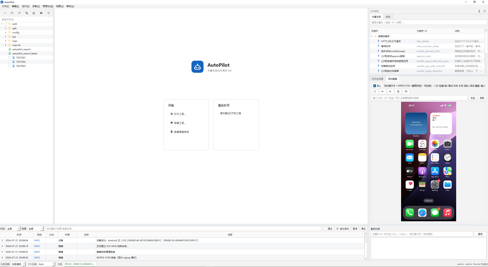
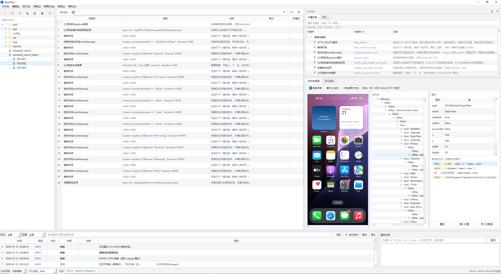

<div align="center">


# AutoPilot

**Full-stack test automation IDE for engineering teams**

[](https://python.org)
[](https://www.riverbankcomputing.com/software/pyqt/)
[](https://www.selenium.dev/)
[](https://appium.io/)

[中文](README.md) · [English](README_en.md)

**[Setup guide](docs/SETUP.md)** · **[Platform pairing](#works-with-platform)** · **[Inspector](docs/inspector.md)** · **[Project model](docs/project-model.md)**

</div>

AutoPilot is a professional desktop IDE for test engineering teams. It unifies keyword-driven automation across web, mobile, API, data, and middleware layers. Together with [AutoPilot Platform](../Autopilot-Platform/README_en.md), it supports the full delivery path—from case design and local validation to remote batch execution and report archival.



---

## Product highlights

* **Keyword-driven authoring** — Visual step editing, object repositories, and parameterized configuration let teams cover routine scenarios without building a framework from scratch; advanced cases extend through custom keywords.
* **Full-stack coverage in one project** — Web (Selenium / Playwright), REST/HTTP, Android (UiAutomator2), and iOS (WDA) in a single project model, reducing toolchain fragmentation and asset sprawl.
* **Inspector-assisted locator maintenance** — Built-in control-tree capture for web, Android, and iOS, with locator backfill and local mirroring to shorten debug cycles.
* **API asset reuse** — Import OpenAPI 3.x and Postman Collections to generate standardized, regression-ready HTTP cases for systematic API testing.
* **Design-to-execution collaboration** — Works with Platform for intent review, binding, artifact publishing, and remote scheduling; local devices can join the shared device pool.
* **Engineering-grade debug and scale-out** — Step-level debugging, structured reports, and execution evidence; multi-device parallelism for large regression and CI workloads.

---

## Get started

### 1. Verify the execution core

No browser or device required—about 30 seconds:

```powershell
# Windows
py -3.12 -m venv .venv
.\.venv\Scripts\python.exe -m pip install -U pip
.\.venv\Scripts\python.exe -m pip install -e .
.\.venv\Scripts\python.exe tests\smoke.py
```

```bash
# Linux / macOS
python3.12 -m venv .venv
./.venv/bin/python -m pip install -U pip
./.venv/bin/python -m pip install -e .
./.venv/bin/python tests/smoke.py
```

Expected: **PASS**, exactly **1** NOIMPL (`sap_login`), no FAIL, exit code **0**.

### 2. Launch the desktop IDE

```powershell
# Windows
.\.venv\Scripts\python.exe -m pip install -e ".[data,mirror,icons]"
.\.venv\Scripts\python.exe tools\preflight.py
.\.venv\Scripts\python.exe run.py
```

```bash
# Linux / macOS
./.venv/bin/python -m pip install -e ".[data,mirror,icons]"
./.venv/bin/python tools/preflight.py
./.venv/bin/python run.py
```

In the IDE: **new project → add Web/HTTP keywords → run → open HTML under `reports/`**.

Headless batch:

```bash
python tools/run_suite.py --project <project-dir>
python tools/run_suite.py --project <project-dir> --parallel --platform android
```

Full dependency matrix: [setup overview](docs/SETUP.md).

---

## Automation coverage

| Layer             | Stack                            | Notes                                       |
|:------------------|:---------------------------------|:--------------------------------------------|
| Web               | Selenium 4 · optional Playwright | Browser UI automation                       |
| HTTP              | Built-in REST client             | Auth, assertions, JsonPath/XPath extraction |
| Android           | UiAutomator2 · adb               | USB / wireless debug devices                |
| iOS               | Direct WDA                       | Windows/Linux can drive WDA-ready devices   |
| Data / middleware | `.[data]` optional               | Redis, SSH, SQLAlchemy, Kafka, etc.         |
| Import            | OpenAPI · Postman                | Deterministic `.tc.yaml` generation         |

---

## Works with Platform

AutoPilot IDE focuses on authoring and local validation. [AutoPilot Platform](../Autopilot-Platform/README_en.md) provides design review, remote scheduling, device-pool governance, and report archival. Together they form a closed loop from review and binding through artifact publishing, remote execution, and result delivery.

Start Platform first, then sign in from IDE connection settings. To register local devices in the shared pool:

```powershell
$env:MC_RUNNER_TOKEN = "<your-runner-token>"
python -m autopilot.runner --server http://127.0.0.1:8000 --token-env MC_RUNNER_TOKEN
```

Integration checklist: [IDE integration](../Autopilot-Platform/docs/architecture/IDE_INTEGRATION.md).

---

## Key capabilities

**Visual authoring** — Project tree, step editor, keyword library, and execution console in one workspace, with light and dark themes for day-to-day authoring and batch runs.

**Inspector and mirroring** — Control-tree capture and locator maintenance for Android, iOS, and web; low-latency Android mirroring and high-frame-rate capture on macOS. See the [inspector guide](docs/inspector.md).



**Intent case landing** — Import Platform-reviewed intent steps and resolve them through project bindings; AI-assisted output remains candidate-only, with models and keys governed on Platform.

**Stability validation** — Mobile Monkey stress testing for dedicated test devices and lab environments. See [iOS Monkey](docs/setup/ios_monkey.md).

---

## Optional extras

| Extra             | Install             | Purpose                      |
|:------------------|:--------------------|:-----------------------------|
| Data / middleware | `.[data]`           | Redis, SSH, SQLAlchemy, etc. |
| Live mirror       | `.[mirror]`         | scrcpy / AVFoundation        |
| Icons             | `.[icons]`          | Vector icons                 |
| Playwright        | `.[web_playwright]` | Optional browser engine      |
| Development       | `.[dev]`            | Tests and static checks      |

Bundled `resources/` ship adb, go-ios, scrcpy, and related tools per OS; run `tools/preflight.py` before first launch.

---

## Layout

```
autopilot/
  ui/           Desktop UI
  keywords/     Keyword implementations
  engine/       Execution and suite orchestration
  mobile/       Device layer (adb, packages, iOS toolchain)
  inspector/    Control tree and local mirroring
  mgmt/         Platform client
  runner/       IDE Runner
docs/           Setup, architecture, platform notes
tools/          Preflight, batch runs, contract checks
```

---

<details>
<summary><strong>Architecture, compatibility, and responsibility split</strong></summary>

### In scope and out of scope

**In scope:** keyword authoring and local debugging; landing reviewed intents; uploading artifacts and app builds; publishing local USB devices as an IDE Runner.

**Out of scope:** replacing Platform multi-tenant access control, remote scheduling, or report archival; completing iOS WDA signing from scratch on Windows/Linux; `mobile_monkey` on personal or production devices.

### Responsibility split with Platform

| Capability               | AutoPilot IDE      | AutoPilot Platform       |
|--------------------------|--------------------|--------------------------|
| Keyword authoring        | Primary            | Browse / govern          |
| Bindings and locators    | Primary            | Stored with artifact     |
| Local debugging          | Primary            | Not in scope             |
| Intent design and review | Import, bind, land | Primary                  |
| Remote batch runs        | Submit and observe | Schedule and govern      |
| Device intake            | IDE Runner         | Pool + standalone Runner |
| AI keys                  | Consume            | Host and control         |

### Version compatibility

Pair IDE and Platform releases per their release notes; project format is `.tc.yaml` / `.map.yaml` (legacy `.tc` / `.map` supported). Integrator details: [`RUNTIME_PIN`](../Autopilot-Platform/contracts/RUNTIME_PIN) and [IDE integration](../Autopilot-Platform/docs/architecture/IDE_INTEGRATION.md).

| IDE version | Platform version | Project format           | Status           |
|-------------|------------------|--------------------------|------------------|
| 0.1.x       | 0.2.x            | `.tc.yaml` / `.map.yaml` | Current dev line |

### Support matrix

| Item          | Minimum | Recommended |
|---------------|---------|-------------|
| Python        | 3.10    | 3.12        |
| Node.js       | 18      | 20 or 22    |
| JDK (Android) | 17+     | 17+         |
| Chrome / Edge | Stable  | Stable      |

iOS: macOS + Xcode for signing and first deploy; Windows/Linux need WDA-ready devices. See [Android](docs/setup/android.md) · [iOS](docs/setup/ios.md).

### Terminology

| Term                    | Definition                                  |
|-------------------------|---------------------------------------------|
| Execution node (Runner) | Any node that claims jobs and executes them |
| Standalone Runner       | CLI process from the Platform repo          |
| IDE Runner              | Local execution node started by this IDE    |
| Device pool             | Device inventory managed by Platform        |

</details>

---

## Documentation

| Doc                                                                                    | Description                     |
|----------------------------------------------------------------------------------------|---------------------------------|
| [Setup overview](docs/SETUP.md)                                                        | Dependency matrix and preflight |
| [Web](docs/setup/web.md) · [Android](docs/setup/android.md) · [iOS](docs/setup/ios.md) | Platform toolchains             |
| [Inspector](docs/inspector.md)                                                         | Control tree and mirroring      |
| [Project model](docs/project-model.md)                                                 | Project file formats            |
| [Platform boundary](docs/managementconsole.md)                                         | Client integration              |
| [Packaging](docs/packaging.md)                                                         | Distribution and `platform.url` |

Development checks:

```bash
python tests/smoke.py
python skills/autopilot-lint/autocheck.py --no-test
```

---

## FAQ

**Keywords unavailable** — run `tools/preflight.py`; middleware needs `.[data]`, mirroring needs `.[mirror]`.

**No devices listed** — check `adb devices` or iOS trust; see [iOS setup](docs/setup/ios.md).

**Cannot reach Platform** — confirm Platform is running and account/project match; dev credentials are loopback-only.

**Remote job did not install the app** — pick an app build version; project artifacts do not include packages.

---

## License

See [LICENSE.txt](LICENSE.txt).
